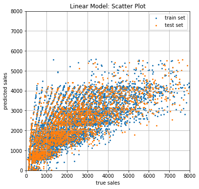
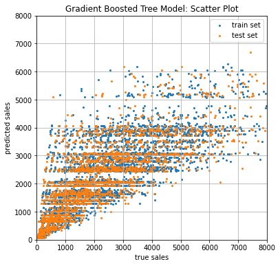
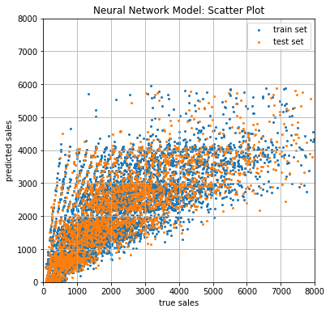
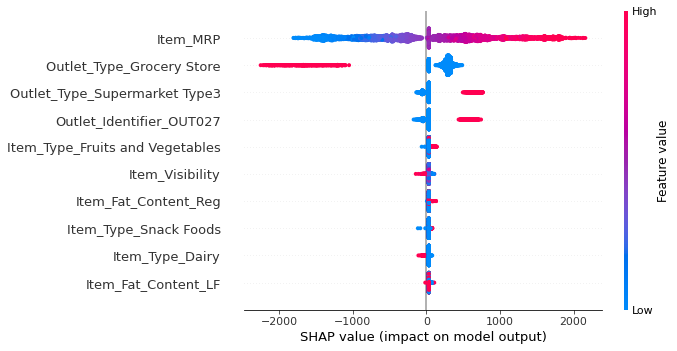

# Predict Bigmart´s Future Sales and Find Driving Features 

## Project Purpose
Predict sales for different Bigmart outlets using different machine learning regression models such as linear, tree and neural network models. Besides the sales forecast, we extract the feature driving sales by using a game-theoretical approach to make decision making of performant blackbox models transparent.
## Setup the Environment using Conda to run the JupyterNotebooks
- $conda create -n myenv python=3.8.11
- $conda active myenv
- $pip install -r requirements.txt

## Modeling Results & Evaluation
The figures 1-3 show the overall model performances for training data (blue) and test data (orange) using a simple linear model, a gradient-boosted tree model and a deep neural network model. Apparently, there is a good match beetween the predictions and the actual sales. The performance metric R2 for the linear model was r2=0.55 (training set) and r2=0.57 (test set). R2 for the gradient-boosted tree model was r2=0.61 (training & test set). R2 for the deep neural network model was r2=0.59 (training & test set). 

<table>
  <tr><td>
    
  </td></tr>
    <tr><td align="center">
    <b>Figure 1. Comparison of true sales and model forecasts using a simple linear model. 
  </td></tr>
</table>

<table>
  <tr><td>
    
  </td></tr>
    <tr><td align="center">
    <b>Figure 2. Comparison of true sales and model forecasts using a gradient-boosted tree model. 
  </td></tr>
</table>

<table>
  <tr><td>
    
  </td></tr>
    <tr><td align="center">
    <b>Figure 3. Comparison of true sales and model forecasts using a deep neural network model with 2 hidden layers. 
  </td></tr>
</table>

## Model Interpretability Using Shapley values from game theory
The Shapley value distibution shows that on average the features with the highest impact on sales are the maximum retail price (i.e. "item_mrp"), the outlet type (i.e. "outlet_type_grocery store", "outlet_type_supermarket_type3") and the unique store id (i.e. "outlet_identifier_out027"). Having a closer look reveales that a higher maximal retail price is correlated with higher sales. This finding is quite surprising since intuitively lower prices should lead to more sales (2b discussed!).

<table>
  <tr><td>
    
  </td></tr>
  <tr><td align="center">
    <b>Figure 2. Explaining local model decisions of the deep neural network model Model with the use of the Shapley values. Each dot represents a single prediction (model decision). 
  </td></tr>
</table>